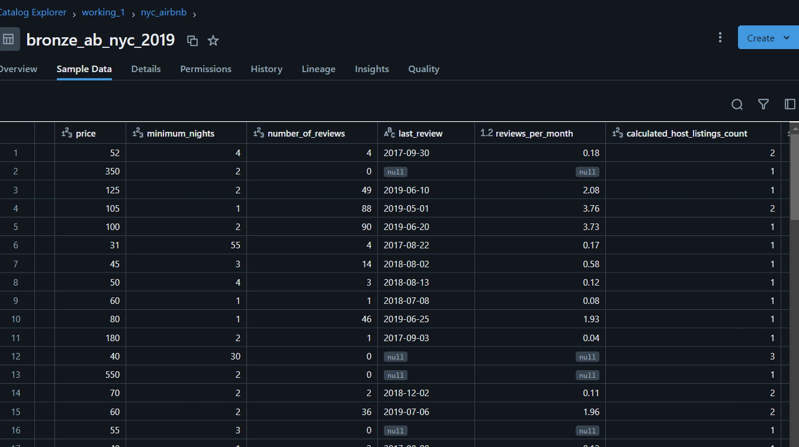
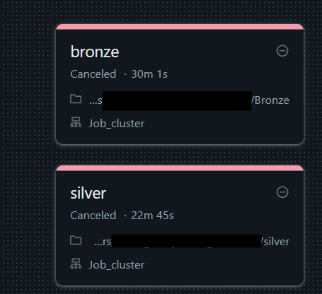

## Databricks 

Bronze - streaming for checking for updates on the folder, if new files added - updates Bronze table

How it looks on UI, database was created

Silver - streaming for checking the updates in Bronze table, if new data - processing and saving into silver table
How it looks on UI, data quality checking added

Created job with tasks for processing - bronze and silver for corresponding files

