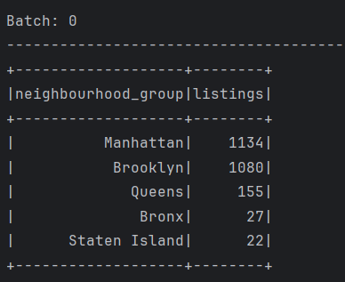
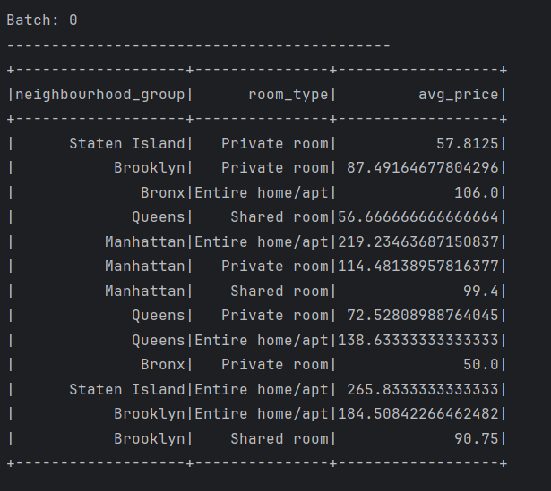
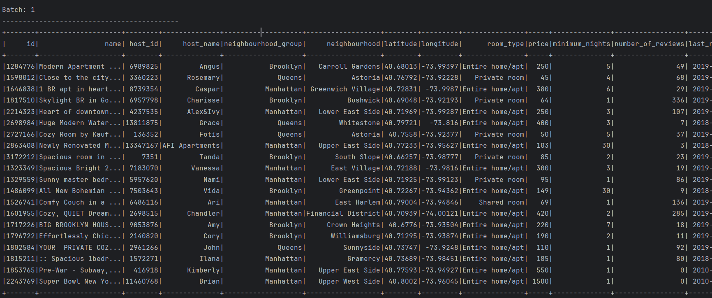

# spark

For running the app - data_processing.py
Data should be located in data/raw folder

# examples

SQL Query 1: Listings by Neighborhood Group

SQL Query 2: Top 10 Most Expensive Listings:

SQL Query 3: Average Price by Room Type:

DataFrame
